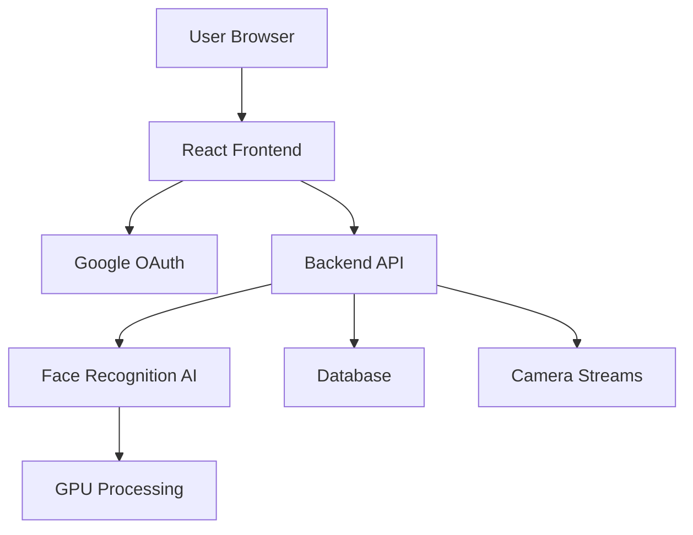
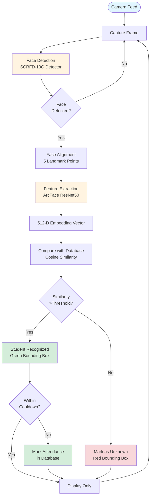

# 🎓 Real-Time Face Recognition Attendance System

[](https://reactjs.org/)
[](https://vitejs.dev/)
[](LICENSE)

A modern, AI-powered attendance management system using facial recognition technology. This repository contains the **frontend application** built with React and Vite, featuring Google OAuth 2.0 authentication and real-time face recognition capabilities.

## ✨ Key Features

| Category | Features |
|----------|----------|
| **🔐 Authentication** | Google OAuth 2.0, Role-Based Access Control, JWT Tokens |
| **👤 Face Recognition** | Real-Time Detection, GPU Acceleration, Multi-Face Support |
| **📊 Attendance** | Auto-Marking, Duplicate Prevention, CSV Export, Analytics |
| **🎯 Student Management** | CRUD Operations, Multi-Photo Upload, Department Organization |
| **📹 Camera System** | Multiple Cameras, RTSP/Webcam Support, Live Monitoring |
| **💬 Messaging** | Student-Admin Communication, Read/Unread Status, Replies |

## 🏗️ System Architecture



### Frontend Structure (React + Vite)
```
frontend/
├── src/
│   ├── main.jsx                   # React entry point
│   ├── App.jsx                    # Main app component
│   ├── auth.js                    # Authentication utilities
│   ├── api.js                     # API client
│   ├── pages/
│   │   └── HomePage.jsx           # Login page
│   └── components/
│       ├── AdminDashboard.jsx     # Admin main dashboard
│       ├── StudentDashboard.jsx   # Student dashboard
│       ├── StudentsManagement.jsx # Student CRUD operations
│       ├── AttendanceManagement.jsx # Attendance records
│       ├── CamerasManagement.jsx  # Camera configuration
│       ├── LiveMonitoring.jsx     # Live recognition feed
│       ├── Messaging.jsx          # Communication hub
│       └── UserManagement.jsx     # User role management
├── package.json
└── vite.config.js
```

## 🚀 Quick Start

### Prerequisites
| Requirement | Version |
|-------------|----------|
| Node.js | 16+ |
| npm | 8+ |
| Google OAuth | 2.0 Credentials |

### Installation

#### 1. Clone Repository
```bash
git clone https://github.com/Thiyanesh07/Attendance_System.git
cd Attendance_System
```

#### 2. Frontend Setup

**Install Dependencies:**
```bash
cd frontend
npm install
```

**Configure Environment:**
Create `frontend/.env` file:
```env
VITE_GOOGLE_CLIENT_ID=your-google-oauth-client-id.apps.googleusercontent.com
VITE_API_BASE_URL=http://localhost:8000
```

#### 4. Google OAuth Setup

1. **Create Google Cloud Project:**
   - Go to [Google Cloud Console](https://console.cloud.google.com/)
   - Create a new project or select existing

2. **Enable APIs:**
   - Navigate to "APIs & Services" → "Library"
   - Enable "Google+ API"

3. **Configure OAuth Consent Screen:**
   - Go to "APIs & Services" → "OAuth consent screen"
   - Select "Internal" or "External"
   - Add authorized domain: `bitsathy.ac.in`

4. **Create OAuth 2.0 Credentials:**
   - Go to "APIs & Services" → "Credentials"
   - Click "Create Credentials" → "OAuth 2.0 Client ID"
   - Application type: "Web application"
   - Add authorized redirect URIs:
     - `http://localhost:5173`
     - `http://localhost:8000`
   - Copy the Client ID

5. **Update Configuration:**
   - Add Client ID to both `backend/.env` and `frontend/.env`

See [README_GOOGLE_AUTH.txt](README_GOOGLE_AUTH.txt) for detailed instructions.

### Running the Application

```bash
cd frontend
npm run dev
```

**Development Server:** http://localhost:5173

**Multiple Instances** (Optional):
```bash
npm run dev:admin     # Port 5173
npm run dev:student1  # Port 5174
npm run dev:student2  # Port 5175
```

## 📖 Basic Workflow

### 🔐 Authentication Flow
```
User Login → Google OAuth → JWT Token → Role Assignment → Dashboard Access
```

### 👨‍🎓 Student Actions
| Action | Description |
|--------|-------------|
| Login | Google sign-in with institutional email |
| View Attendance | Check personal attendance records |
| Send Messages | Contact administration |
| View Statistics | Personal attendance analytics |

### 👨‍💼 Admin Actions
| Action | Description |
|--------|-------------|
| Manage Students | Add/Edit/Delete student profiles |
| Configure Cameras | Setup webcams and IP cameras |
| Live Monitoring | Real-time face recognition |
| Mark Attendance | Auto or manual marking |
| Send Messages | Broadcast announcements |

### 🎯 Face Recognition Flow



## ⚙️ Technology Stack

| Component | Technology |
|-----------|------------|
| Frontend Framework | React 18.2.0 |
| Build Tool | Vite 5.2.0 |
| Routing | React Router DOM 6.23.1 |
| Authentication | Google OAuth 2.0 |
| State Management | React Hooks |
| Styling | CSS3 |
| API Communication | Fetch API / WebSocket |

## 🔒 Security Features

- **Domain Restriction** - Only institutional emails allowed
- **JWT Authentication** - Secure token-based API access
- **Role-Based Access** - Separate admin/student permissions
- **Password Hashing** - Bcrypt encryption (if applicable)
- **CORS Protection** - Configured allowed origins
- **Token Expiration** - 7-day JWT validity

## 🤝 Contributing

Contributions are welcome! Please feel free to submit a Pull Request.

## 📄 License

This project is licensed under the MIT License.

## 👥 Authors

- Thiyanesh07 - [GitHub](https://github.com/Thiyanesh07)

## 🙏 Acknowledgments

- **InsightFace** - Face recognition models
- **FastAPI** - Modern Python web framework
- **React** - Frontend framework
- **Google OAuth** - Authentication service

## 📞 Contact & Support

For issues and questions:
- 📧 Email: [your-email@example.com]
- 💬 GitHub Issues: [Open an issue](https://github.com/Thiyanesh07/Attendance_System/issues)

---

## ⚠️ Important Note

**This repository contains only the FRONTEND code.** 

The backend implementation (FastAPI server, AI models, database services, and recognition engine) is proprietary and not included in this public repository.

### 🔒 Backend Services Include:
- FastAPI REST API & WebSocket server
- Face detection & recognition AI models (InsightFace)
- GPU-accelerated processing pipeline
- Database management & ORM
- Authentication & authorization services
- Real-time streaming services
- Camera integration modules

### 💼 For Backend Access

If you're interested in:
- Complete backend source code
- System deployment and configuration
- Custom integrations and modifications
- Training and support services
- Commercial licensing

**Please reach out to:**
- 📧 **Email**: thiyanesh7777@gmail.com
- 💼 **GitHub**: [@Thiyanesh07](https://github.com/Thiyanesh07)
- 🔗 **LinkedIn**: www.linkedin.com/in/thiyanesh-d-6a7637331

---

**Note:** This system is designed for educational institutions. The frontend can be adapted for different domains by configuring the authentication endpoints.
